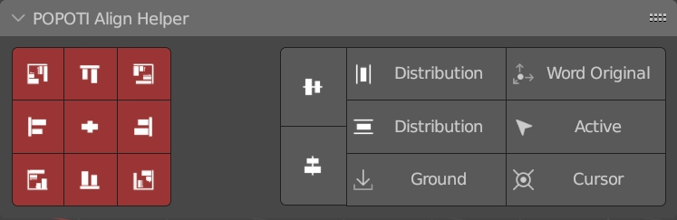

# POPOTI Align Helper
# Move to [AIGODLIKE](https://github.com/AIGODLIKE/popoti_align_helper)

More friendly alignment based on observation perspective

Align Mode: 

- Word Original:Aligning to the world origin is the same as resetting  

- Active:Align to Active Object 

- Cursor:Align to Cursor(Scale reset 1) 

- Ground:Align Ground 

- Distribution:Distribution Align 

- Align:General alignment, you can set the alignment of each axis(maximum, center, minimum) 
