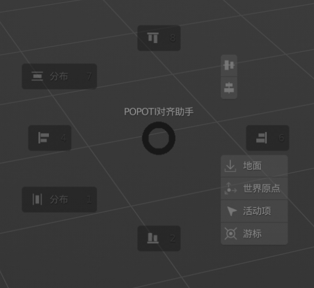
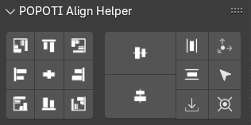

# POPOTI Align Helper

More friendly alignment based on observation perspective 

# v1.2.0
## Add

- Ctrl Alt A Align Pie Menu

# v1.1.0
## Add

- Distribution alignment mode Add alignment by interval distance 
  The moving object will be fixed, and the distance between other objects and the moving object will be adjusted (bounding box)

- Preferences can set whether to display button text 
  

Align Mode: 

- World Original:Aligning to the world origin is the same as resetting  

- Active:Align to Active Object 

- Cursor:Align to Cursor(Scale reset 1) 

- Ground:Align Ground 

- Distribution:Distribution Align 

- Align:General alignment, you can set the alignment of each axis(maximum, center, minimum) 
