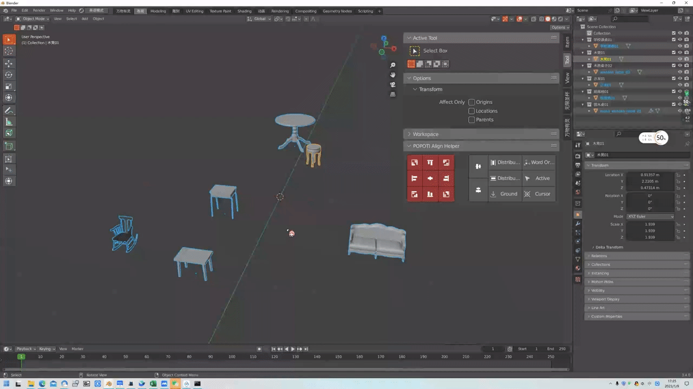
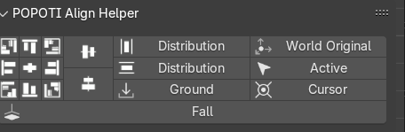
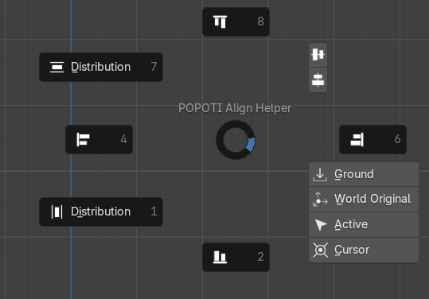
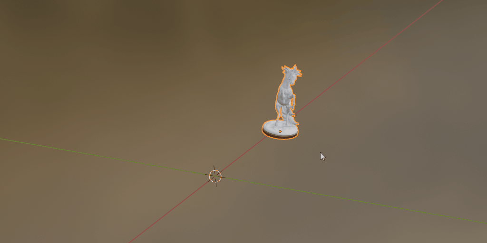
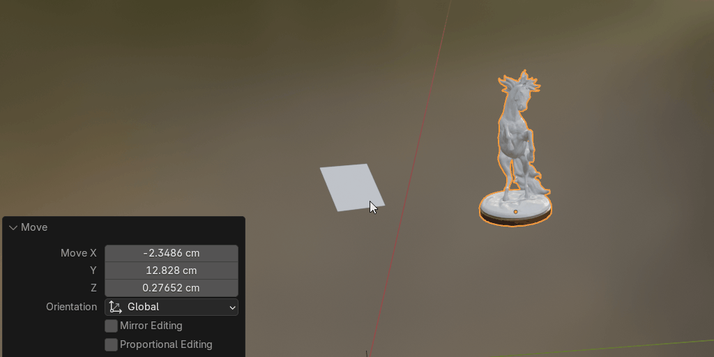
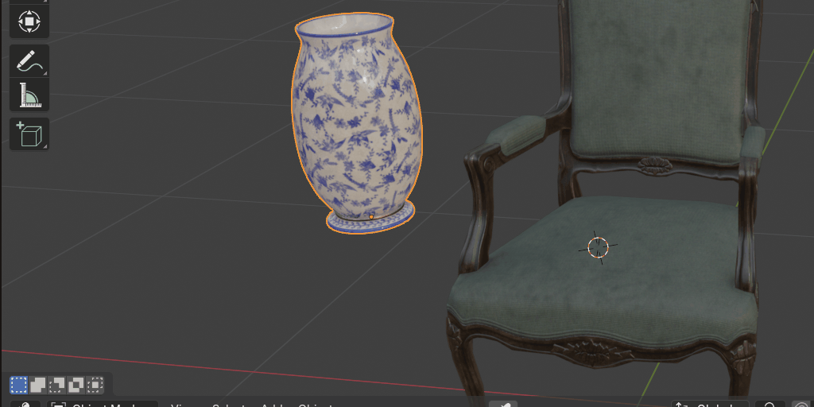
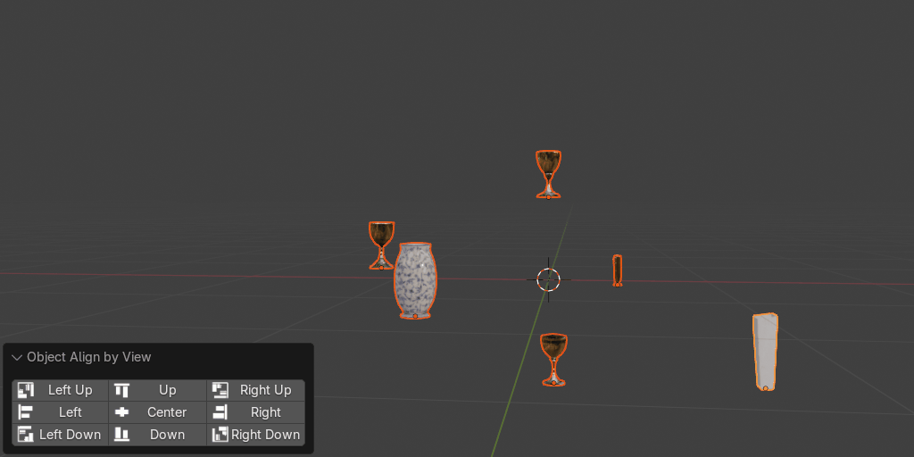

# POPOTI Align Helper

More friendly alignment based on observation perspective 

Align Objects Combined presses
- Ctrl    Align Rotation 
-  Shift  Align Zoom 
-  Alt     Align Position 

Ctrl Alt A Align Pie Menu

Install:  
If it is version 4.2, you can drag the plugin directly into Blender.
Conventional methods:

Align Mode: 

- World Original:Aligning to the world origin is the same as resetting  
  
- Active:Align to Active Object 
  
- Cursor:Align to Cursor(Scale reset 1) 
  
- Ground:Align Ground 
  
- Distribution:Distribution Align 
  
- Align:General alignment, you can set the alignment of each axis(maximum, center, minimum) 
  

